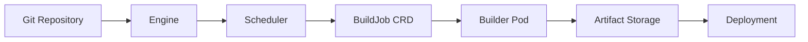

# Topi Development Guide for Kubernetes

## Table of Contents
1. [Overview](#overview)
2. [Development Environment Setup](#development-environment-setup)
3. [Project Structure](#project-structure)
4. [Storage Architecture](#storage-architecture)
5. [Builder Pod Architecture](#builder-pod-architecture)
6. [Artifact Management](#artifact-management)
7. [Development Workflow](#development-workflow)
8. [Testing Strategy](#testing-strategy)
9. [Debugging Techniques](#debugging-techniques)
10. [CI/CD Pipeline](#cicd-pipeline)
11. [Production Readiness](#production-readiness)

## Overview

This guide covers how to develop, test, and deploy the Topi CI/CD system on Kubernetes. Topi consists of three main components that work together to provide a complete CI/CD solution:



### Development Philosophy
- **Kubernetes-native**: Everything runs in Kubernetes, even during development
- **Fast iteration**: Hot reload and quick feedback loops
- **Production-like**: Development environment mirrors production
- **Isolated builds**: Each build runs in its own pod
- **Cloud-agnostic**: Works locally and in any cloud

## Development Environment Setup

### Prerequisites

Install the following tools:

```bash
# macOS installation
brew install kind kubectl skaffold kustomize helm mkcert

# Optional but recommended
brew install --cask lens  # Kubernetes IDE
brew install stern        # Multi-pod log tailing
brew install kubectx      # Context/namespace switching
brew install k9s          # Terminal UI for Kubernetes

# Install Tilt (better than Skaffold for development)
curl -fsSL https://raw.githubusercontent.com/tilt-dev/tilt/master/scripts/install.sh | bash
```

### Create Development Cluster

Create a comprehensive setup script:

```bash
#!/bin/bash
# scripts/setup-dev-cluster.sh

set -e

CLUSTER_NAME="${CLUSTER_NAME:-topi-dev}"
REGISTRY_NAME="${REGISTRY_NAME:-kind-registry}"
REGISTRY_PORT="${REGISTRY_PORT:-5001}"

echo "🚀 Setting up Topi development cluster..."

# Check if cluster already exists
if kind get clusters | grep -q "^${CLUSTER_NAME}$"; then
    echo "Cluster ${CLUSTER_NAME} already exists. Delete it first with: kind delete cluster --name ${CLUSTER_NAME}"
    exit 1
fi

# Create Kind cluster configuration
cat <<EOF > /tmp/kind-config.yaml
kind: Cluster
apiVersion: kind.x-k8s.io/v1alpha4
name: ${CLUSTER_NAME}
nodes:
- role: control-plane
  kubeadmConfigPatches:
  - |
    kind: InitConfiguration
    nodeRegistration:
      kubeletExtraArgs:
        node-labels: "ingress-ready=true"
  extraPortMappings:
  # Ingress controller ports
  - containerPort: 80
    hostPort: 80
    protocol: TCP
  - containerPort: 443
    hostPort: 443
    protocol: TCP
  # Registry port
  - containerPort: 5000
    hostPort: ${REGISTRY_PORT}
    protocol: TCP
  # MinIO ports
  - containerPort: 30900
    hostPort: 9000
    protocol: TCP
  - containerPort: 30901
    hostPort: 9001
    protocol: TCP
- role: worker
  extraMounts:
  # Mount for build cache
  - hostPath: /tmp/topi-cache
    containerPath: /cache
  # Mount for artifacts (development only)
  - hostPath: /tmp/topi-artifacts
    containerPath: /artifacts
- role: worker
  extraMounts:
  - hostPath: /tmp/topi-cache
    containerPath: /cache
  - hostPath: /tmp/topi-artifacts
    containerPath: /artifacts
EOF

# Create the cluster
echo "📦 Creating Kind cluster..."
kind create cluster --config /tmp/kind-config.yaml

# Create local registry
echo "🐳 Starting local Docker registry..."
docker run -d \
  --restart=always \
  --name "${REGISTRY_NAME}" \
  -p "${REGISTRY_PORT}:5000" \
  registry:2

# Connect registry to Kind network
docker network connect "kind" "${REGISTRY_NAME}" || true

# Document the local registry
cat <<EOF | kubectl apply -f -
apiVersion: v1
kind: ConfigMap
metadata:
  name: local-registry-hosting
  namespace: kube-public
data:
  localRegistryHosting.v1: |
    host: "localhost:${REGISTRY_PORT}"
    help: "https://kind.sigs.k8s.io/docs/user/local-registry/"
EOF

# Install NGINX Ingress Controller
echo "🌐 Installing Ingress Controller..."
kubectl apply -f https://raw.githubusercontent.com/kubernetes/ingress-nginx/main/deploy/static/provider/kind/deploy.yaml
kubectl wait --namespace ingress-nginx \
  --for=condition=ready pod \
  --selector=app.kubernetes.io/component=controller \
  --timeout=90s

# Create namespaces
echo "📁 Creating namespaces..."
kubectl create namespace topi-system
kubectl create namespace topi-builds

# Install cert-manager for TLS
echo "🔐 Installing cert-manager..."
kubectl apply -f https://github.com/cert-manager/cert-manager/releases/download/v1.13.0/cert-manager.yaml
kubectl wait --namespace cert-manager \
  --for=condition=ready pod \
  --selector=app.kubernetes.io/component=webhook \
  --timeout=90s

echo "✅ Development cluster ready!"
echo ""
echo "Registry: localhost:${REGISTRY_PORT}"
echo "Cluster: ${CLUSTER_NAME}"
echo ""
echo "Next steps:"
echo "  1. Run 'make dev-setup' to install Topi components"
echo "  2. Run 'skaffold dev' or 'tilt up' to start development"
```

## Project Structure

### Complete Project Layout

```
topi/
├── .github/
│   └── workflows/
│       ├── ci.yaml              # CI pipeline
│       └── release.yaml         # Release automation
├── builder/
│   ├── cmd/
│   │   └── main.go             # Builder entrypoint
│   ├── internal/
│   │   ├── config/             # Configuration parsing
│   │   ├── workflow/           # Workflow engine
│   │   │   ├── steps/         # Step implementations
│   │   │   │   ├── core/     # Built-in steps
│   │   │   │   ├── container/# Container build steps
│   │   │   │   └── artifact/ # Artifact management
│   │   │   └── executor.go   # Workflow executor
│   │   ├── storage/           # Storage backends
│   │   │   ├── interface.go  # Storage interface
│   │   │   ├── minio.go      # MinIO implementation
│   │   │   ├── s3.go         # S3 implementation
│   │   │   └── local.go      # Local filesystem
│   │   └── utils/
│   ├── Dockerfile
│   ├── Dockerfile.dev          # Development with hot-reload
│   └── go.mod
├── scheduler/
│   ├── api/
│   │   └── v1alpha1/
│   │       ├── buildjob_types.go
│   │       └── zz_generated.deepcopy.go
│   ├── config/
│   │   ├── crd/              # CRD definitions
│   │   ├── manager/          # Controller deployment
│   │   └── rbac/             # RBAC rules
│   ├── controllers/
│   │   └── buildjob_controller.go
│   ├── Dockerfile
│   └── main.go
├── engine/
│   ├── cmd/
│   ├── internal/
│   │   ├── git/              # Git monitoring
│   │   ├── webhook/          # Webhook handlers
│   │   └── trigger/          # Build triggers
│   └── Dockerfile
├── deploy/
│   ├── base/                 # Base Kubernetes manifests
│   │   ├── namespace.yaml
│   │   ├── rbac.yaml
│   │   ├── storage.yaml
│   │   ├── configmaps.yaml
│   │   └── secrets.yaml
│   ├── components/           # Optional components
│   │   ├── minio/
│   │   │   ├── deployment.yaml
│   │   │   ├── service.yaml
│   │   │   ├── ingress.yaml
│   │   │   └── kustomization.yaml
│   │   ├── registry/
│   │   │   └── harbor/
│   │   ├── gitea/
│   │   └── monitoring/
│   │       ├── prometheus/
│   │       └── grafana/
│   ├── overlays/            # Environment-specific configs
│   │   ├── development/
│   │   │   ├── kustomization.yaml
│   │   │   └── patches/
│   │   ├── staging/
│   │   └── production/
│   └── helm/                # Helm charts (optional)
│       └── topi/
├── scripts/
│   ├── setup-dev-cluster.sh
│   ├── install-tools.sh
│   └── integration-tests.sh
├── tests/
│   ├── e2e/                 # End-to-end tests
│   ├── integration/         # Integration tests
│   └── samples/             # Sample BuildJobs
├── docs/
│   ├── architecture/
│   ├── api/
│   └── guides/
├── Makefile
├── Tiltfile                 # Tilt configuration
├── skaffold.yaml           # Skaffold configuration
└── .air.toml               # Hot reload configuration
```

## Storage Architecture

### Storage Types and Usage

```yaml
# deploy/base/storage.yaml
---
# 1. Build Cache - Shared across all builds
apiVersion: v1
kind: PersistentVolumeClaim
metadata:
  name: build-cache
  namespace: topi-builds
spec:
  accessModes: [ReadWriteMany]
  storageClassName: standard
  resources:
    requests:
      storage: 50Gi
---
# 2. Artifact Storage - Long-term storage
apiVersion: v1
kind: PersistentVolumeClaim
metadata:
  name: artifact-storage
  namespace: topi-system
spec:
  accessModes: [ReadWriteMany]
  storageClassName: standard
  resources:
    requests:
      storage: 100Gi
---
# 3. Registry Storage - For container images
apiVersion: v1
kind: PersistentVolumeClaim
metadata:
  name: registry-storage
  namespace: topi-system
spec:
  accessModes: [ReadWriteOnce]
  storageClassName: fast-ssd
  resources:
    requests:
      storage: 200Gi
```

### MinIO Configuration for Development

```yaml
# deploy/components/minio/deployment.yaml
apiVersion: apps/v1
kind: Deployment
metadata:
  name: minio
  namespace: topi-system
spec:
  replicas: 1
  selector:
    matchLabels:
      app: minio
  template:
    metadata:
      labels:
        app: minio
    spec:
      containers:
      - name: minio
        image: minio/minio:latest
        args:
        - server
        - /data
        - --console-address
        - ":9001"
        env:
        - name: MINIO_ROOT_USER
          valueFrom:
            secretKeyRef:
              name: minio-credentials
              key: access-key
        - name: MINIO_ROOT_PASSWORD
          valueFrom:
            secretKeyRef:
              name: minio-credentials
              key: secret-key
        - name: MINIO_DEFAULT_BUCKETS
          value: "artifacts,cache,logs"
        ports:
        - containerPort: 9000
          name: api
        - containerPort: 9001
          name: console
        volumeMounts:
        - name: data
          mountPath: /data
        livenessProbe:
          httpGet:
            path: /minio/health/live
            port: 9000
          initialDelaySeconds: 30
          periodSeconds: 10
        readinessProbe:
          httpGet:
            path: /minio/health/ready
            port: 9000
          initialDelaySeconds: 10
          periodSeconds: 5
        resources:
          requests:
            memory: "512Mi"
            cpu: "250m"
          limits:
            memory: "2Gi"
            cpu: "1000m"
      volumes:
      - name: data
        persistentVolumeClaim:
          claimName: minio-storage
---
apiVersion: v1
kind: Service
metadata:
  name: minio
  namespace: topi-system
spec:
  type: NodePort
  ports:
  - port: 9000
    targetPort: 9000
    nodePort: 30900
    name: api
  - port: 9001
    targetPort: 9001
    nodePort: 30901
    name: console
  selector:
    app: minio
---
apiVersion: v1
kind: Secret
metadata:
  name: minio-credentials
  namespace: topi-system
type: Opaque
stringData:
  access-key: minioadmin
  secret-key: minioadmin123
  endpoint: minio:9000
```

## Builder Pod Architecture

### Pod Template Generation

```go
// scheduler/internal/pods/builder.go
package pods

import (
    "fmt"
    corev1 "k8s.io/api/core/v1"
    "k8s.io/apimachinery/pkg/api/resource"
    metav1 "k8s.io/apimachinery/pkg/apis/meta/v1"
    "github.com/tobiaskrok/topi/topi-operator/api/v1alpha1"
)

type BuilderPodConfig struct {
    BuildJob       *v1alpha1.BuildJob
    BuilderImage   string
    Namespace      string
    ServiceAccount string
    Resources      ResourceConfig
}

type ResourceConfig struct {
    RequestCPU    string
    RequestMemory string
    LimitCPU      string
    LimitMemory   string
}

func NewBuilderPod(config BuilderPodConfig) *corev1.Pod {
    return &corev1.Pod{
        ObjectMeta: metav1.ObjectMeta{
            Name:      fmt.Sprintf("builder-%s", config.BuildJob.Name),
            Namespace: config.Namespace,
            Labels: map[string]string{
                "app":        "topi-builder",
                "build-id":   config.BuildJob.Name,
                "build-repo": sanitizeLabel(config.BuildJob.Spec.Repository),
            },
            Annotations: map[string]string{
                "buildjob.topi.io/name":       config.BuildJob.Name,
                "buildjob.topi.io/repository": config.BuildJob.Spec.Repository,
            },
        },
        Spec: corev1.PodSpec{
            ServiceAccountName: config.ServiceAccount,
            RestartPolicy:      corev1.RestartPolicyNever,
            
            InitContainers: buildInitContainers(config),
            Containers:     buildContainers(config),
            Volumes:        buildVolumes(config),
            
            // Security context
            SecurityContext: &corev1.PodSecurityContext{
                RunAsNonRoot: &[]bool{true}[0],
                RunAsUser:    &[]int64{1000}[0],
                FSGroup:      &[]int64{1000}[0],
            },
            
            // Node selection
            NodeSelector: map[string]string{
                "workload-type": "builds",
            },
            
            // Tolerations for dedicated build nodes
            Tolerations: []corev1.Toleration{
                {
                    Key:      "workload-type",
                    Operator: corev1.TolerationOpEqual,
                    Value:    "builds",
                    Effect:   corev1.TaintEffectNoSchedule,
                },
            },
        },
    }
}

func buildInitContainers(config BuilderPodConfig) []corev1.Container {
    return []corev1.Container{
        // Git clone container
        {
            Name:  "git-clone",
            Image: "alpine/git:2.40.1",
            Command: []string{"sh", "-c"},
            Args: []string{
                fmt.Sprintf(`
                    git clone --depth 1 --branch %s %s /workspace/source
                    cd /workspace/source
                    git log -1 --pretty=format:"%%H" > /workspace/commit-sha
                    git log -1 --pretty=format:"%%an" > /workspace/commit-author
                `, 
                config.BuildJob.Spec.Branch,
                config.BuildJob.Spec.Repository),
            },
            VolumeMounts: []corev1.VolumeMount{
                {Name: "workspace", MountPath: "/workspace"},
            },
            Resources: corev1.ResourceRequirements{
                Requests: corev1.ResourceList{
                    corev1.ResourceCPU:    resource.MustParse("100m"),
                    corev1.ResourceMemory: resource.MustParse("128Mi"),
                },
            },
        },
        
        // Cache restore container
        {
            Name:  "cache-restore",
            Image: "minio/mc:latest",
            Command: []string{"sh", "-c"},
            Args: []string{`
                mc alias set cache $MINIO_ENDPOINT $MINIO_ACCESS_KEY $MINIO_SECRET_KEY
                
                # Restore Go module cache
                if mc stat cache/cache/go-mod-${REPO_HASH}/go.sum; then
                    mc cp -r cache/cache/go-mod-${REPO_HASH}/ /cache/go/
                fi
                
                # Restore npm cache
                if mc stat cache/cache/npm-${REPO_HASH}/package-lock.json; then
                    mc cp -r cache/cache/npm-${REPO_HASH}/ /cache/npm/
                fi
            `},
            Env: buildEnvVars(config),
            VolumeMounts: []corev1.VolumeMount{
                {Name: "cache", MountPath: "/cache"},
            },
        },
    }
}

func buildContainers(config BuilderPodConfig) []corev1.Container {
    return []corev1.Container{
        {
            Name:  "builder",
            Image: config.BuilderImage,
            Env:   buildEnvVars(config),
            EnvFrom: []corev1.EnvFromSource{
                {
                    SecretRef: &corev1.SecretEnvSource{
                        LocalObjectReference: corev1.LocalObjectReference{
                            Name: "minio-credentials",
                        },
                    },
                },
                {
                    SecretRef: &corev1.SecretEnvSource{
                        LocalObjectReference: corev1.LocalObjectReference{
                            Name: "registry-credentials",
                        },
                        Optional: &[]bool{true}[0],
                    },
                },
            },
            VolumeMounts: []corev1.VolumeMount{
                {Name: "workspace", MountPath: "/workspace"},
                {Name: "cache", MountPath: "/cache"},
                {Name: "docker-config", MountPath: "/kaniko/.docker"},
                {Name: "artifacts", MountPath: "/artifacts"},
            },
            Resources: corev1.ResourceRequirements{
                Requests: corev1.ResourceList{
                    corev1.ResourceCPU:    resource.MustParse(config.Resources.RequestCPU),
                    corev1.ResourceMemory: resource.MustParse(config.Resources.RequestMemory),
                },
                Limits: corev1.ResourceList{
                    corev1.ResourceCPU:    resource.MustParse(config.Resources.LimitCPU),
                    corev1.ResourceMemory: resource.MustParse(config.Resources.LimitMemory),
                },
            },
        },
        
        // Sidecar for artifact upload
        {
            Name:  "artifact-uploader",
            Image: "minio/mc:latest",
            Command: []string{"sh", "-c"},
            Args: []string{`
                # Watch for artifacts and upload them
                while true; do
                    if [ -d /artifacts/upload ]; then
                        mc alias set artifacts $MINIO_ENDPOINT $MINIO_ACCESS_KEY $MINIO_SECRET_KEY
                        mc cp -r /artifacts/upload/ artifacts/artifacts/${BUILD_ID}/
                        mv /artifacts/upload /artifacts/uploaded-$(date +%s)
                    fi
                    sleep 5
                done
            `},
            Env: buildEnvVars(config),
            VolumeMounts: []corev1.VolumeMount{
                {Name: "artifacts", MountPath: "/artifacts"},
            },
        },
    }
}

func buildVolumes(config BuilderPodConfig) []corev1.Volume {
    return []corev1.Volume{
        {
            Name: "workspace",
            VolumeSource: corev1.VolumeSource{
                EmptyDir: &corev1.EmptyDirVolumeSource{
                    SizeLimit: &[]resource.Quantity{resource.MustParse("10Gi")}[0],
                },
            },
        },
        {
            Name: "cache",
            VolumeSource: corev1.VolumeSource{
                PersistentVolumeClaim: &corev1.PersistentVolumeClaimVolumeSource{
                    ClaimName: "build-cache",
                },
            },
        },
        {
            Name: "artifacts",
            VolumeSource: corev1.VolumeSource{
                EmptyDir: &corev1.EmptyDirVolumeSource{},
            },
        },
        {
            Name: "docker-config",
            VolumeSource: corev1.VolumeSource{
                Secret: &corev1.SecretVolumeSource{
                    SecretName: "docker-registry-config",
                    Optional:   &[]bool{true}[0],
                },
            },
        },
    }
}

func buildEnvVars(config BuilderPodConfig) []corev1.EnvVar {
    return []corev1.EnvVar{
        {Name: "BUILD_ID", Value: config.BuildJob.Name},
        {Name: "SOURCE_REPO", Value: config.BuildJob.Spec.Repository},
        {Name: "SOURCE_BRANCH", Value: config.BuildJob.Spec.Branch},
        {Name: "SOURCE_WORKFLOW", Value: config.BuildJob.Spec.WorkflowPath},
        {Name: "WORKSPACE", Value: "/workspace/source"},
        {Name: "CACHE_DIR", Value: "/cache"},
        {Name: "ARTIFACTS_DIR", Value: "/artifacts"},
        {Name: "MINIO_ENDPOINT", Value: "minio.topi-system:9000"},
        {Name: "REGISTRY_ENDPOINT", Value: "localhost:5001"},
        {Name: "GOCACHE", Value: "/cache/go/build"},
        {Name: "GOPATH", Value: "/cache/go/path"},
        {Name: "npm_config_cache", Value: "/cache/npm"},
        {Name: "REPO_HASH", Value: hashRepo(config.BuildJob.Spec.Repository)},
    }
}
```

## Artifact Management

### Storage Interface

```go
// builder/internal/storage/interface.go
package storage

import (
    "context"
    "io"
    "time"
)

type Storage interface {
    // Upload uploads a file to storage
    Upload(ctx context.Context, key string, reader io.Reader, metadata map[string]string) (*UploadResult, error)
    
    // Download downloads a file from storage
    Download(ctx context.Context, key string) (io.ReadCloser, error)
    
    // List lists files with a given prefix
    List(ctx context.Context, prefix string) ([]*ObjectInfo, error)
    
    // Delete deletes a file
    Delete(ctx context.Context, key string) error
    
    // GetURL returns a presigned URL for downloading
    GetURL(ctx context.Context, key string, expiry time.Duration) (string, error)
}

type UploadResult struct {
    Key      string
    Size     int64
    Checksum string
    URL      string
}

type ObjectInfo struct {
    Key          string
    Size         int64
    LastModified time.Time
    Metadata     map[string]string
}
```

### MinIO Implementation

```go
// builder/internal/storage/minio.go
package storage

import (
    "context"
    "fmt"
    "io"
    "time"
    
    "github.com/minio/minio-go/v7"
    "github.com/minio/minio-go/v7/pkg/credentials"
)

type MinIOStorage struct {
    client   *minio.Client
    bucket   string
    endpoint string
}

func NewMinIOStorage(endpoint, accessKey, secretKey, bucket string) (*MinIOStorage, error) {
    client, err := minio.New(endpoint, &minio.Options{
        Creds:  credentials.NewStaticV4(accessKey, secretKey, ""),
        Secure: false, // Set to true for production with TLS
    })
    if err != nil {
        return nil, fmt.Errorf("failed to create MinIO client: %w", err)
    }
    
    // Ensure bucket exists
    ctx := context.Background()
    exists, err := client.BucketExists(ctx, bucket)
    if err != nil {
        return nil, fmt.Errorf("failed to check bucket: %w", err)
    }
    
    if !exists {
        err = client.MakeBucket(ctx, bucket, minio.MakeBucketOptions{})
        if err != nil {
            return nil, fmt.Errorf("failed to create bucket: %w", err)
        }
    }
    
    return &MinIOStorage{
        client:   client,
        bucket:   bucket,
        endpoint: endpoint,
    }, nil
}

func (m *MinIOStorage) Upload(ctx context.Context, key string, reader io.Reader, metadata map[string]string) (*UploadResult, error) {
    opts := minio.PutObjectOptions{
        UserMetadata: metadata,
    }
    
    info, err := m.client.PutObject(ctx, m.bucket, key, reader, -1, opts)
    if err != nil {
        return nil, fmt.Errorf("failed to upload object: %w", err)
    }
    
    url := fmt.Sprintf("minio://%s/%s/%s", m.endpoint, m.bucket, key)
    
    return &UploadResult{
        Key:      key,
        Size:     info.Size,
        Checksum: info.ETag,
        URL:      url,
    }, nil
}

func (m *MinIOStorage) Download(ctx context.Context, key string) (io.ReadCloser, error) {
    return m.client.GetObject(ctx, m.bucket, key, minio.GetObjectOptions{})
}

func (m *MinIOStorage) GetURL(ctx context.Context, key string, expiry time.Duration) (string, error) {
    url, err := m.client.PresignedGetObject(ctx, m.bucket, key, expiry, nil)
    if err != nil {
        return "", fmt.Errorf("failed to generate presigned URL: %w", err)
    }
    return url.String(), nil
}
```

### Artifact Upload Step

```go
// builder/internal/workflow/steps/artifact/upload.go
package artifact

import (
    "context"
    "fmt"
    "os"
    "path/filepath"
    
    "github.com/tobiaskrok/topi/builder/internal/config"
    "github.com/tobiaskrok/topi/builder/internal/storage"
    "github.com/tobiaskrok/topi/builder/internal/workflow"
)

func init() {
    workflow.RegisterStep("artifact-upload", newUploadStep)
}

type UploadStep struct {
    name     string
    source   string
    dest     string
    storage  storage.Storage
}

func newUploadStep(cfg config.StepConfig) (workflow.Step, error) {
    // Initialize storage based on configuration
    storageBackend := os.Getenv("STORAGE_BACKEND")
    if storageBackend == "" {
        storageBackend = "minio"
    }
    
    var store storage.Storage
    var err error
    
    switch storageBackend {
    case "minio":
        store, err = storage.NewMinIOStorage(
            os.Getenv("MINIO_ENDPOINT"),
            os.Getenv("MINIO_ACCESS_KEY"),
            os.Getenv("MINIO_SECRET_KEY"),
            "artifacts",
        )
    case "s3":
        store, err = storage.NewS3Storage()
    case "local":
        store, err = storage.NewLocalStorage("/artifacts")
    default:
        return nil, fmt.Errorf("unknown storage backend: %s", storageBackend)
    }
    
    if err != nil {
        return nil, fmt.Errorf("failed to initialize storage: %w", err)
    }
    
    return &UploadStep{
        name:    cfg.Name,
        source:  cfg.Params["source"],
        dest:    cfg.Params["destination"],
        storage: store,
    }, nil
}

func (s *UploadStep) Exec(ctx *workflow.WorkflowContext) (*workflow.StepResult, error) {
    buildID := os.Getenv("BUILD_ID")
    
    // Handle glob patterns
    matches, err := filepath.Glob(s.source)
    if err != nil {
        return nil, fmt.Errorf("invalid glob pattern: %w", err)
    }
    
    var artifacts []string
    
    for _, match := range matches {
        file, err := os.Open(match)
        if err != nil {
            return nil, fmt.Errorf("failed to open file %s: %w", match, err)
        }
        defer file.Close()
        
        // Generate artifact key
        key := fmt.Sprintf("builds/%s/%s/%s", buildID, s.dest, filepath.Base(match))
        
        // Upload to storage
        result, err := s.storage.Upload(context.Background(), key, file, map[string]string{
            "build-id": buildID,
            "step":     s.name,
        })
        
        if err != nil {
            return nil, fmt.Errorf("failed to upload %s: %w", match, err)
        }
        
        artifacts = append(artifacts, result.URL)
        fmt.Printf("Uploaded: %s -> %s\n", match, result.URL)
    }
    
    // Store artifact URLs in environment for next steps
    ctx.EnvironmentManager.Set("ARTIFACTS_"+s.name, strings.Join(artifacts, ","))
    
    return &workflow.StepResult{
        Status: workflow.StepSuccess,
        Outputs: map[string]string{
            "artifacts": strings.Join(artifacts, ","),
        },
    }, nil
}
```

## Development Workflow

### Hot Reload with Tilt

Create a `Tiltfile` for development:

```python
# Tiltfile
load('ext://restart_process', 'docker_build_with_restart')

# Configure default registry
default_registry('localhost:5001')

# Builder component
docker_build_with_restart(
    'localhost:5001/topi-builder',
    './builder',
    dockerfile='./builder/Dockerfile.dev',
    entrypoint=['/app/air'],
    live_update=[
        sync('./builder', '/app'),
        run('cd /app && go mod download', trigger=['./builder/go.mod', './builder/go.sum']),
    ]
)

# Scheduler component
docker_build_with_restart(
    'localhost:5001/topi-scheduler',
    './scheduler',
    dockerfile='./scheduler/Dockerfile.dev',
    entrypoint=['/app/air'],
    live_update=[
        sync('./scheduler', '/app'),
        run('cd /app && go mod download', trigger=['./scheduler/go.mod', './scheduler/go.sum']),
    ]
)

# Engine component
docker_build_with_restart(
    'localhost:5001/topi-engine',
    './engine',
    dockerfile='./engine/Dockerfile.dev',
    entrypoint=['/app/air'],
    live_update=[
        sync('./engine', '/app'),
        run('cd /app && go mod download', trigger=['./engine/go.mod', './engine/go.sum']),
    ]
)

# Apply Kubernetes manifests
k8s_yaml([
    'deploy/base/namespace.yaml',
    'deploy/base/rbac.yaml',
    'deploy/base/storage.yaml',
    'deploy/base/configmaps.yaml',
    'deploy/base/secrets.yaml',
])

# Deploy MinIO
k8s_yaml(kustomize('deploy/components/minio'))

# Deploy components
k8s_yaml([
    'deploy/overlays/development/builder.yaml',
    'deploy/overlays/development/scheduler.yaml',
    'deploy/overlays/development/engine.yaml',
])

# Port forwards
k8s_resource('minio', port_forwards=['9000:9000', '9001:9001'])
k8s_resource('scheduler', port_forwards='8080:8080')
k8s_resource('engine', port_forwards='8081:8080')

# Create test BuildJob button
local_resource(
    'test-build',
    cmd='kubectl apply -f tests/samples/test-buildjob.yaml',
    deps=['tests/samples/test-buildjob.yaml']
)
```

### Air Configuration for Hot Reload

```toml
# .air.toml
root = "."
testdata_dir = "testdata"
tmp_dir = "tmp"

[build]
  args_bin = []
  bin = "./tmp/main"
  cmd = "go build -o ./tmp/main ./cmd/main.go"
  delay = 1000
  exclude_dir = ["assets", "tmp", "vendor", "testdata"]
  exclude_file = []
  exclude_regex = ["_test.go"]
  exclude_unchanged = false
  follow_symlink = false
  full_bin = ""
  include_dir = []
  include_ext = ["go", "tpl", "tmpl", "html"]
  kill_delay = "0s"
  log = "build-errors.log"
  send_interrupt = false
  stop_on_error = true

[color]
  app = ""
  build = "yellow"
  main = "magenta"
  runner = "green"
  watcher = "cyan"

[log]
  time = false

[misc]
  clean_on_exit = false

[screen]
  clear_on_rebuild = false
```

## Testing Strategy

### Unit Tests

```go
// builder/internal/workflow/executor_test.go
package workflow_test

import (
    "testing"
    "github.com/stretchr/testify/assert"
    "github.com/tobiaskrok/topi/builder/internal/workflow"
)

func TestWorkflowExecution(t *testing.T) {
    tests := []struct {
        name     string
        workflow string
        wantErr  bool
    }{
        {
            name: "simple echo workflow",
            workflow: `
version: "1.0"
name: "Test"
jobs:
  test:
    steps:
      - name: "Echo"
        uses: "echo"
        params:
          message: "Hello"`,
            wantErr: false,
        },
    }
    
    for _, tt := range tests {
        t.Run(tt.name, func(t *testing.T) {
            // Test implementation
        })
    }
}
```

### Integration Tests

```bash
#!/bin/bash
# scripts/integration-tests.sh

set -e

echo "🧪 Running integration tests..."

# Deploy test environment
kubectl apply -k deploy/overlays/test/

# Wait for components to be ready
kubectl wait --for=condition=ready pod -l app=topi-scheduler --timeout=60s
kubectl wait --for=condition=ready pod -l app=topi-engine --timeout=60s

# Create test BuildJob
kubectl apply -f - <<EOF
apiVersion: topi.io/v1alpha1
kind: BuildJob
metadata:
  name: integration-test-$(date +%s)
spec:
  repository: https://github.com/topi-test/sample-app
  branch: main
  workflowPath: .topi/workflow.yaml
EOF

# Wait for build to complete
kubectl wait --for=condition=complete buildjob/integration-test --timeout=300s

# Check artifacts were uploaded
# ... verification logic

echo "✅ Integration tests passed!"
```

### End-to-End Tests

```yaml
# tests/e2e/full-pipeline.yaml
apiVersion: batch/v1
kind: Job
metadata:
  name: e2e-test
spec:
  template:
    spec:
      containers:
      - name: test
        image: localhost:5001/topi-test:latest
        command: ["/bin/sh"]
        args:
        - -c
        - |
          # Test complete pipeline
          # 1. Create BuildJob
          kubectl apply -f /tests/buildjob.yaml
          
          # 2. Wait for completion
          kubectl wait --for=condition=complete buildjob/test --timeout=300s
          
          # 3. Verify artifacts
          mc alias set minio http://minio:9000 $MINIO_ACCESS_KEY $MINIO_SECRET_KEY
          mc ls minio/artifacts/builds/
          
          # 4. Verify deployment
          kubectl get deployment test-app
          
          # 5. Check application health
          curl http://test-app/health
      restartPolicy: Never
```

## Debugging Techniques

### Debugging Builder Pods

```bash
# 1. Get pod logs
kubectl logs -f $(kubectl get pod -l app=topi-builder -o jsonpath='{.items[0].metadata.name}')

# 2. Stream logs from all builder pods
stern "builder-*" --since 1m

# 3. Exec into running builder
kubectl exec -it $(kubectl get pod -l app=topi-builder -o jsonpath='{.items[0].metadata.name}') -- sh

# 4. Debug failed pods
kubectl describe pod builder-xxx
kubectl logs builder-xxx --previous

# 5. Copy artifacts from pod
kubectl cp builder-xxx:/artifacts ./local-artifacts
```

### Remote Debugging with Delve

```yaml
# deploy/overlays/development/builder-debug.yaml
apiVersion: apps/v1
kind: Deployment
metadata:
  name: builder-debug
spec:
  template:
    spec:
      containers:
      - name: builder
        image: localhost:5001/topi-builder:debug
        command: ["dlv"]
        args:
        - "exec"
        - "/app/builder"
        - "--headless"
        - "--listen=:2345"
        - "--api-version=2"
        - "--accept-multiclient"
        ports:
        - containerPort: 2345
          name: debug
```

```bash
# Connect to debugger
kubectl port-forward deployment/builder-debug 2345:2345

# In VS Code, attach to localhost:2345
```

### Monitoring and Observability

```yaml
# deploy/components/monitoring/prometheus-config.yaml
apiVersion: v1
kind: ConfigMap
metadata:
  name: prometheus-config
data:
  prometheus.yml: |
    global:
      scrape_interval: 15s
    scrape_configs:
    - job_name: 'topi-builder'
      kubernetes_sd_configs:
      - role: pod
      relabel_configs:
      - source_labels: [__meta_kubernetes_pod_label_app]
        action: keep
        regex: topi-builder
      - source_labels: [__meta_kubernetes_pod_name]
        target_label: instance
```

## CI/CD Pipeline

### GitHub Actions for Topi

```yaml
# .github/workflows/ci.yaml
name: CI Pipeline

on:
  push:
    branches: [main, develop]
  pull_request:
    branches: [main]

env:
  REGISTRY: ghcr.io
  GO_VERSION: '1.22'

jobs:
  test:
    runs-on: ubuntu-latest
    steps:
    - uses: actions/checkout@v3
    
    - name: Set up Go
      uses: actions/setup-go@v4
      with:
        go-version: ${{ env.GO_VERSION }}
    
    - name: Run tests
      run: |
        go test -v -race -coverprofile=coverage.out ./...
        go tool cover -html=coverage.out -o coverage.html
    
    - name: Upload coverage
      uses: actions/upload-artifact@v3
      with:
        name: coverage
        path: coverage.html
  
  lint:
    runs-on: ubuntu-latest
    steps:
    - uses: actions/checkout@v3
    - name: golangci-lint
      uses: golangci/golangci-lint-action@v3
      with:
        version: latest
  
  build:
    needs: [test, lint]
    runs-on: ubuntu-latest
    strategy:
      matrix:
        component: [builder, scheduler, engine]
    steps:
    - uses: actions/checkout@v3
    
    - name: Set up Docker Buildx
      uses: docker/setup-buildx-action@v2
    
    - name: Log in to GitHub Container Registry
      uses: docker/login-action@v2
      with:
        registry: ${{ env.REGISTRY }}
        username: ${{ github.actor }}
        password: ${{ secrets.GITHUB_TOKEN }}
    
    - name: Build and push
      uses: docker/build-push-action@v4
      with:
        context: ./${{ matrix.component }}
        push: ${{ github.event_name != 'pull_request' }}
        tags: |
          ${{ env.REGISTRY }}/${{ github.repository }}/${{ matrix.component }}:latest
          ${{ env.REGISTRY }}/${{ github.repository }}/${{ matrix.component }}:${{ github.sha }}
        cache-from: type=gha
        cache-to: type=gha,mode=max
  
  integration:
    needs: build
    runs-on: ubuntu-latest
    if: github.event_name != 'pull_request'
    steps:
    - uses: actions/checkout@v3
    
    - name: Create Kind cluster
      uses: helm/kind-action@v1.5.0
      with:
        config: tests/kind-config.yaml
    
    - name: Deploy Topi
      run: |
        kubectl apply -k deploy/overlays/test/
        kubectl wait --for=condition=ready pod -l app=topi-scheduler --timeout=120s
    
    - name: Run integration tests
      run: ./scripts/integration-tests.sh
    
    - name: Collect logs
      if: failure()
      run: |
        kubectl logs -l app=topi-scheduler > scheduler.log
        kubectl logs -l app=topi-engine > engine.log
        kubectl logs -l app=topi-builder > builder.log
    
    - name: Upload logs
      if: failure()
      uses: actions/upload-artifact@v3
      with:
        name: logs
        path: "*.log"
```

### Release Pipeline

```yaml
# .github/workflows/release.yaml
name: Release

on:
  push:
    tags:
      - 'v*'

jobs:
  release:
    runs-on: ubuntu-latest
    steps:
    - uses: actions/checkout@v3
    
    - name: Set up QEMU
      uses: docker/setup-qemu-action@v2
    
    - name: Set up Docker Buildx
      uses: docker/setup-buildx-action@v2
    
    - name: Log in to GitHub Container Registry
      uses: docker/login-action@v2
      with:
        registry: ghcr.io
        username: ${{ github.actor }}
        password: ${{ secrets.GITHUB_TOKEN }}
    
    - name: Build and push multi-arch images
      run: |
        for component in builder scheduler engine; do
          docker buildx build \
            --platform linux/amd64,linux/arm64 \
            --tag ghcr.io/${{ github.repository }}/${component}:${GITHUB_REF#refs/tags/} \
            --tag ghcr.io/${{ github.repository }}/${component}:latest \
            --push \
            ./${component}
        done
    
    - name: Generate Helm chart
      run: |
        helm package deploy/helm/topi
        helm push topi-*.tgz oci://ghcr.io/${{ github.repository }}/charts
    
    - name: Create Release
      uses: softprops/action-gh-release@v1
      with:
        files: |
          topi-*.tgz
          deploy/install.yaml
```

## Production Readiness

### Security Hardening

```yaml
# deploy/base/security-policies.yaml
apiVersion: policy/v1beta1
kind: PodSecurityPolicy
metadata:
  name: topi-builder
spec:
  privileged: false
  allowPrivilegeEscalation: false
  requiredDropCapabilities:
    - ALL
  volumes:
    - 'configMap'
    - 'emptyDir'
    - 'projected'
    - 'secret'
    - 'downwardAPI'
    - 'persistentVolumeClaim'
  hostNetwork: false
  hostIPC: false
  hostPID: false
  runAsUser:
    rule: 'MustRunAsNonRoot'
  seLinux:
    rule: 'RunAsAny'
  supplementalGroups:
    rule: 'RunAsAny'
  fsGroup:
    rule: 'RunAsAny'
```

### Resource Quotas

```yaml
# deploy/base/resource-quotas.yaml
apiVersion: v1
kind: ResourceQuota
metadata:
  name: build-quota
  namespace: topi-builds
spec:
  hard:
    requests.cpu: "100"
    requests.memory: 200Gi
    persistentvolumeclaims: "10"
    pods: "50"
---
apiVersion: v1
kind: LimitRange
metadata:
  name: build-limits
  namespace: topi-builds
spec:
  limits:
  - max:
      cpu: "4"
      memory: "8Gi"
    min:
      cpu: "100m"
      memory: "128Mi"
    default:
      cpu: "1"
      memory: "2Gi"
    defaultRequest:
      cpu: "500m"
      memory: "1Gi"
    type: Container
```

### Monitoring Stack

```yaml
# deploy/components/monitoring/kustomization.yaml
apiVersion: kustomize.config.k8s.io/v1beta1
kind: Kustomization

resources:
  - https://github.com/prometheus-operator/kube-prometheus/manifests/setup
  - https://github.com/prometheus-operator/kube-prometheus/manifests/

patchesStrategicMerge:
  - prometheus-config.yaml
  - grafana-dashboards.yaml

configMapGenerator:
  - name: topi-dashboards
    files:
      - dashboards/builder.json
      - dashboards/scheduler.json
      - dashboards/storage.json
```

### High Availability

```yaml
# deploy/overlays/production/ha-scheduler.yaml
apiVersion: apps/v1
kind: Deployment
metadata:
  name: scheduler
spec:
  replicas: 3
  strategy:
    type: RollingUpdate
    rollingUpdate:
      maxSurge: 1
      maxUnavailable: 0
  template:
    spec:
      affinity:
        podAntiAffinity:
          requiredDuringSchedulingIgnoredDuringExecution:
          - labelSelector:
              matchExpressions:
              - key: app
                operator: In
                values:
                - topi-scheduler
            topologyKey: kubernetes.io/hostname
```

## Makefile Commands

```makefile
# Complete Makefile for development
.PHONY: help
help: ## Show this help message
	@grep -E '^[a-zA-Z_-]+:.*?## .*$$' $(MAKEFILE_LIST) | awk 'BEGIN {FS = ":.*?## "}; {printf "\033[36m%-30s\033[0m %s\n", $$1, $$2}'

# Development
.PHONY: dev-setup
dev-setup: ## Complete development environment setup
	./scripts/setup-dev-cluster.sh
	$(MAKE) dev-deps
	$(MAKE) dev-storage
	$(MAKE) dev-deploy

.PHONY: dev-deps
dev-deps: ## Install development dependencies
	go install github.com/cosmtrek/air@latest
	go install github.com/go-delve/delve/cmd/dlv@latest
	go mod download

.PHONY: dev-storage
dev-storage: ## Deploy storage components (MinIO, Registry)
	kubectl apply -k deploy/components/minio
	kubectl apply -k deploy/components/registry
	kubectl wait --for=condition=ready pod -l app=minio --timeout=60s

.PHONY: dev-deploy
dev-deploy: ## Deploy all Topi components
	kubectl apply -k deploy/overlays/development
	kubectl wait --for=condition=ready pod -l app.kubernetes.io/part-of=topi --timeout=120s

.PHONY: dev-run
dev-run: ## Run with hot reload using Tilt
	tilt up

.PHONY: dev-stop
dev-stop: ## Stop Tilt
	tilt down

.PHONY: dev-logs
dev-logs: ## Stream logs from all components
	stern "topi-" --since 1m

.PHONY: dev-test
dev-test: ## Run unit tests
	go test -v -race ./...

.PHONY: dev-integration
dev-integration: ## Run integration tests
	./scripts/integration-tests.sh

.PHONY: dev-e2e
dev-e2e: ## Run end-to-end tests
	kubectl apply -f tests/e2e/
	kubectl wait --for=condition=complete job/e2e-test --timeout=600s

.PHONY: dev-clean
dev-clean: ## Clean up build artifacts and pods
	kubectl delete buildjobs --all -n topi-builds
	kubectl delete pods -l app=topi-builder -n topi-builds
	rm -rf tmp/ bin/

.PHONY: dev-reset
dev-reset: ## Complete reset of development environment
	kind delete cluster --name topi-dev
	docker rm -f kind-registry
	rm -rf /tmp/topi-*
	$(MAKE) dev-setup

# Building
.PHONY: build
build: ## Build all components
	$(MAKE) build-builder
	$(MAKE) build-scheduler
	$(MAKE) build-engine

.PHONY: build-builder
build-builder: ## Build builder component
	cd builder && go build -o bin/builder cmd/main.go

.PHONY: build-scheduler
build-scheduler: ## Build scheduler component
	cd scheduler && go build -o bin/manager main.go

.PHONY: build-engine
build-engine: ## Build engine component
	cd engine && go build -o bin/engine cmd/main.go

.PHONY: docker-build
docker-build: ## Build all Docker images
	docker build -t localhost:5001/topi-builder:latest ./builder
	docker build -t localhost:5001/topi-scheduler:latest ./scheduler
	docker build -t localhost:5001/topi-engine:latest ./engine

.PHONY: docker-push
docker-push: docker-build ## Push images to local registry
	docker push localhost:5001/topi-builder:latest
	docker push localhost:5001/topi-scheduler:latest
	docker push localhost:5001/topi-engine:latest

# Testing
.PHONY: test
test: ## Run all tests
	$(MAKE) test-unit
	$(MAKE) test-integration
	$(MAKE) test-e2e

.PHONY: test-unit
test-unit: ## Run unit tests with coverage
	go test -v -race -coverprofile=coverage.out ./...
	go tool cover -html=coverage.out -o coverage.html

.PHONY: test-integration
test-integration: ## Run integration tests
	./scripts/integration-tests.sh

.PHONY: test-e2e
test-e2e: ## Run end-to-end tests
	kubectl apply -f tests/e2e/
	kubectl wait --for=condition=complete job/e2e-test --timeout=600s

.PHONY: test-smoke
test-smoke: ## Quick smoke test
	kubectl apply -f tests/samples/simple-buildjob.yaml
	kubectl wait --for=condition=complete buildjob/simple --timeout=120s

# Utilities
.PHONY: fmt
fmt: ## Format Go code
	gofmt -s -w .
	go mod tidy

.PHONY: lint
lint: ## Run linters
	golangci-lint run ./...

.PHONY: generate
generate: ## Generate code (CRDs, deepcopy, etc.)
	cd scheduler && controller-gen object:headerFile="hack/boilerplate.go.txt" paths="./..."
	cd scheduler && controller-gen crd rbac:roleName=manager-role webhook paths="./..." output:crd:artifacts:config=config/crd/bases

.PHONY: port-forward
port-forward: ## Port forward essential services
	kubectl port-forward svc/minio 9000:9000 9001:9001 &
	kubectl port-forward svc/scheduler 8080:8080 &
	kubectl port-forward svc/engine 8081:8080 &

.PHONY: create-buildjob
create-buildjob: ## Create a sample BuildJob
	kubectl apply -f tests/samples/test-buildjob.yaml

.PHONY: watch-builds
watch-builds: ## Watch BuildJob status
	watch -n 2 kubectl get buildjobs,pods -n topi-builds

# Release
.PHONY: release
release: ## Create a new release
	@read -p "Enter version (e.g., v1.0.0): " VERSION; \
	git tag -a $$VERSION -m "Release $$VERSION"; \
	git push origin $$VERSION
```

## Conclusion

This development guide provides a comprehensive approach to developing Topi on Kubernetes. The key principles are:

1. **Everything in Kubernetes** - Even during development
2. **Fast feedback loops** - Hot reload, quick tests
3. **Production-like** - Development mirrors production
4. **Automated** - Scripts and tools for everything
5. **Observable** - Logs, metrics, and debugging built-in

Start with the basic setup and gradually add components as needed. The modular architecture allows you to develop and test each component independently while maintaining the overall system integrity.